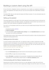
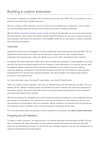
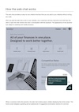
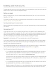
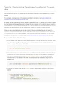
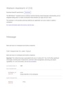

The following samples are excerpted from the documentation for IBM Watson Assistant as it existed on 4 May 2023. (Watson Assistant has since been rebranded as [watsonx Assistant](https://www.ibm.com/products/watsonx-assistant).)

**Note:** Nonfunctioning links from the original context are rendered as bold text.

<table>
  <tr>
    <td style="width:20%"></td>
    <td>
      
<a href="api-client.html"><b>Programming tutorial</b></a>

      
A programming tutorial with extensive use of code examples, intended for developers building client applications that use the Watson Assistant REST API. For this tutorial, I designed and wrote a simple example client application (in both Python and JavaScript). The tutorial takes an iterative approach, showing multiple executable versions of the code examples as more function is added.

      

      <b>Note:</b> In the live documentation hosted on ibm.com, readers can choose to view code examples in either JavaScript (Node.js) or Python. This static version shows only the JavaScript examples.
      

    </td>
  </tr>
  <tr>
    <td></td>
    <td>
      
<a href="build-custom-extension.html"><b>UI-based procedure</b></a>

      
A procedure that explains how to use the Watson Assistant custom extension feature to configure an integration with a third-party service that has a REST API. The procedure describes using the Watson Assistant settings UI to complete the required steps, and is intended for advanced users who understand REST API concepts.

    </td>
  </tr>
  <tr>
    <td></td>
    <td>
      
<a href="web-chat-architecture.html"><b>Conceptual overview</b></a>

      
This conceptual overview provides an overall architectural description of the Watson Assistant web chat feature, which is a customizable widget that can be integrated with a customer website to provide a chatbot UI.

      
This overview starts with a description of the web chat widget's behavior from an end user's perspective, using screen captures to illustrate. It then provides details about the types of chatbot responses for which the widget has out-of-the-box support.

      
The <b>Technical details</b> section, intended for more advanced users, provides an overview of detailed information that developers or administrators might need to know. In the original live version of the documentat, this overview provided numerous links to detailed documentation elsewhere.

    </td>
  </tr>
  <tr>
    <td></td>
    <td>
      
<a href="web-chat-security-enable.html"><b>Progamming task</b></a>

      
This documentation is intended for web developers who understand how to use JSON Web Token (JWT). It provides a technical explanation and JavaScript code examples to explain how to enable the web chat security feature.

    </td>
  </tr>
<tr>
  <td></td>
  <td>
      
<a href="web-chat-develop-size-position.html"><b>Programming tutorial</b></a>

      
This tutorial is intended for web developers who want to use the Watson Assistant web chat API to customize the appearance of the web chat widget in ways that go beyond the options available in the settings UI.

      
The tutorial was developed using a collaborative process. I worked closely with a developer, who provided a fully functional code example (in an external GitHub repo) and a rough draft of the tutorial steps. I then revised the tutorial for clarity, style, and consistency. These revisions included minor edits to correct grammar or style, as well as more significant revisions (such as inserting missing steps and additional code examples for clarity).

      
This tutorial was one of a set of similar developer tutorials that were part of a long-running project to enhance the web chat developer documentation.

  </td>
</tr>
<tr>
  <td></td>
  <td>
    
<a href="assistant-v1.html"><b>API reference</b></a>

    
Reference documentation for the Watson Assistant v1 REST API. This documentation is intended for programmers who want to use the API to build a custom client application, or to use the API to programmatically modify training artifacts or configuration options for a workspace. This documentation is generated from the <a href="assistant-v1.json">OpenAPI specification</a>, which I owned and maintained (working in collaboration with the development team).

    
<b>Note:</b> In the live documentation hosted on ibm.com, the reference information is supplemented with request examples and SDK information for multiple languages. Those elements are merged with the OpenAPI specification by an internal build process, so they are not included in the static rendering shown here.

  </td>
</tr>
</table>

<i>All content in these writing samples is the property of the IBM Corporation.</i>
